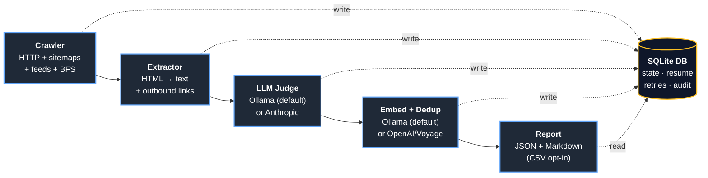

# redline architecture

This document is a high-level orientation for anyone reading or contributing to the `redline` codebase. It covers the pipeline, the package layout, the data model, and the load-bearing design decisions.

For installation and usage, see the [README](../README.md). For contribution mechanics, see [CONTRIBUTING.md](../CONTRIBUTING.md).

---

## The pipeline at a glance



Every stage is **idempotent** with respect to the SQLite database: re-running a stage on the same DB does not duplicate work. Already-processed rows are skipped, and partially-completed work resumes from the last committed checkpoint. Every stage transition, every outbound API call, and every error is logged to the `events` table with full context for offline analysis.

---

## Package layout

`redline` follows the conventional Go layout. The `internal/` tree is private — Go enforces that external modules cannot import it.

```
cmd/redline/         CLI entry point (cobra). One file per subcommand.
internal/
  app/               High-level scan orchestration — wires the stages together.
  config/            prompts.yaml loader + JSON-schema validator.
  cost/              USD pricing tables + preflight cost estimator + budget enforcement.
  crawl/             Crawler — sitemap-index + feed discovery + BFS link-following + URL canonicalization.
  emb/               Embedding-provider clients (Ollama, OpenAI, Voyage).
  embed/             Pass 2 — cosine-similarity duplicate detection over page embeddings.
  errs/              Sentinel errors and exit-code mapping.
  extract/           HTML → (body_text, outbound_links). Primary-region selection.
  httpx/             Shared HTTP client + universal exponential-backoff retry wrapper.
  judge/             LLM-call orchestrator + JSON-schema validation + 6 cross-field invariants.
  llm/               Provider-agnostic LLMClient interface.
  llm/anthropic/     Anthropic provider implementation (prompt caching enabled).
  llm/ollama/        Ollama provider implementation (local-first default).
  log/               Structured slog handler with dual-sink (stderr + events table) and PII redaction.
  report/            JSON + Markdown report rendering, deterministic ordering.
  report/normalize/  Stable-placeholder substitution for golden-file tests.
  store/             SQLite repository layer. Single writer per stage.
  version/           Build metadata (Version, Commit, Date) baked in via LDFLAGS.
e2e/                 End-to-end tests against the fixture site + deterministic fake LLM.
e2e/fakellm/         Deterministic LLM stand-in keyed by URL — drives the golden-file tests.
examples/            Drop-in prompts.yaml templates for three verticals.
testdata/
  fixture-site/      Hand-authored test fixture site (Acme Security fictional brand).
  golden/            Byte-for-byte golden files for the report rendering tests.
  prompts/           Minimal prompts.yaml used by the e2e tests.
```

---

## Lifecycle of a `scan` invocation

1. **Parse CLI flags + `prompts.yaml`.** A `run` row is inserted with status `running` and a full resolved-config snapshot.
2. **Initialize the DB.** Schema migrations run idempotently against the `--db` path.
3. **Preflight checks.** Ollama reachability + required model presence (when local), API keys (when cloud), target-site reachability + `robots.txt`.
4. **Compute the cost estimate.** Based on discovered page count × prompts × per-token pricing (or $0 for local).
5. **User confirms (or `--yes` skips).** Local runs skip the prompt unless `--confirm-local` is set.
6. **Crawl phase.** Workers fetch URLs and write `pages` rows. Per-URL state machine: `discovered` → `fetching` → `fetched` | `failed`. Resumable.
7. **Judge phase.** Workers pull pages without a classification, call the LLM, write `classifications` rows. Per-URL state machine: `pending` → `judging` → `judged` | `failed` | `unclear`. Resumable.
8. **Embed + dedup phase** (default on). Workers pull pages without an embedding for the chosen provider+model, call the embedder, write `embeddings` rows. After all embeddings are stored, compute pairwise cosine similarity and write `duplicates` + cluster assignments. Resumable.
9. **Report phase.** Read the DB, render JSON + Markdown (+ optional CSV) to the output directory, also store as BLOBs in the `reports` table.
10. **Completion.** `runs.completed_at` set; `runs.status = completed`; final summary event written.

**Crash semantics.** Every phase commits state at the per-item level (per URL, per classification, per embedding). A SIGKILL mid-phase loses at most the in-flight items being processed by active workers. The next `redline scan` against the same DB resumes by default.

---

## Load-bearing design decisions

### Local-first by default

The default `--llm-provider=ollama` runs entirely on the user's machine; no cloud API keys are required. This is a deliberate choice — both for cost (cloud GEO audits get expensive at site-scale) and for privacy (page bodies don't leave localhost). Cloud providers are opt-in for users who want speed or model quality at higher cost.

### Single-writer SQLite per stage

SQLite is the durable state store and the audit trail. Each stage in the pipeline runs as a coordinator goroutine that owns DB writes for its stage; worker goroutines do the I/O-bound work (HTTP fetches, LLM calls) and hand results back to the coordinator via channels. This avoids SQLite's `database is locked` errors that arise from naive multi-writer patterns.

### Universal retry wrapper

Every outbound HTTP call (target site, Ollama, Anthropic, OpenAI, Voyage) flows through `internal/httpx.Do`, which implements the project's exponential-backoff retry policy. Stage packages don't write their own retry loops — there is exactly one implementation, and it's the only one that interprets `Retry-After` headers, classifies 5xx vs 4xx, etc.

### Eight-label judge rubric

The judge classifies each page with exactly one primary label plus zero-or-more secondary labels from the same set: `Aligned`, `Stale`, `OffBrand`, `Contradictory`, `Redundant`, `Thin`, `Zombie`, `Unclear`. The rubric is intentionally small — eight categories cover the practical action space (KEEP / UPDATE / REWRITE / DELETE / MANUAL_REVIEW) without overloading the judge with subtle distinctions it can't reliably make.

### Schema validation + cross-field invariants

Every LLM response is validated against a JSON schema embedded at build time (`internal/judge/response.schema.json`). On top of the schema, the judge enforces six cross-field invariants in Go code:

1. `Aligned` pages have empty findings, null edit plan, null `should_focus_on`, and `KEEP` action.
2. `UPDATE` / `REWRITE` actions require a non-null edit plan and at least one finding.
3. `DELETE` actions require ≥1 finding and a null edit plan.
4. `MANUAL_REVIEW` requires `confidence < 0.6`.
5. Every `quoted_text` must be a literal substring of the page body — the post-processor drops findings whose quotes don't match.
6. Every prompt ID in `affected_prompts` must match an ID in `prompts.yaml`.

Schema-invalid responses trigger up to three re-prompts with progressively narrower context before the page is marked `Unclear`. The temperature stays at 0.0 across retries; we change the prompt, not the sampler.

### Deterministic output

The report renderer (`internal/report`) is deterministic for a fixed DB input. Every collection is explicitly sorted at the boundary; `map` iteration order is never relied on. This is asserted by a test that renders the same DB twice and compares byte-for-byte. Determinism matters because the report is meant to be diff-able against itself across runs.

### Agent-actionable Markdown

The `report.md` artifact is designed for a downstream LLM to consume and apply. Each finding includes:

- A `quoted_text` field that is a literal substring of the page body — the editor agent can locate it with a string match.
- A `location_hint` field for human readability.
- A `suggested_fix` field with a concrete edit recommendation.

The structured `edit_plan` (`preserve` / `remove` / `rewrite` / `add`) is the playbook the editor agent executes.

### Universal logging contract

Every stage in the pipeline logs to two sinks: stderr (for the user) and an `events` table in the SQLite DB (for offline analysis). Every event carries `run_id`, `stage`, `event_type`, `severity`, and optional `url`/`page_id` context. The PII redactor in `internal/log/redact.go` strips common API-key patterns from any string-valued attribute before write.

---

## Where to start reading code

- **First time:** `cmd/redline/scan_cmd.go` → `internal/app/scan.go`. The end-to-end orchestration is most of the story.
- **Understanding the judge:** `internal/judge/judge.go` + `internal/judge/prompt.tmpl` + `internal/judge/response.schema.json`.
- **Understanding the crawler:** `internal/crawl/crawler.go` + `internal/crawl/sitemap.go` + `internal/crawl/canonicalize.go`.
- **Adding a new LLM provider:** implement `internal/llm.LLMClient`. See `internal/llm/anthropic/anthropic.go` for the canonical implementation; cloud providers need prompt caching wired up to keep costs bounded.
- **Adding a new embedding provider:** implement `internal/emb.EmbeddingClient`. Existing implementations: Ollama (local), OpenAI, Voyage.
- **Changing report output:** `internal/report/report.go` (Go structs + JSON tags) and `internal/report/markdown.go` (Markdown rendering). Regenerate golden files with `go test -tags=e2e ./e2e/... -update`.

---

## Things not in v1 (and why)

These are intentional non-goals for `0.1.0-alpha`. Some may land later; others are explicit scope exclusions.

- **No JavaScript rendering.** SPAs without server-side rendering will produce thin extractions. `redline` warns when ≥30% of pages return effectively empty bodies. Adding headless-browser support would multiply the dependency surface and the cost-per-page; for now the answer is "use SSR or look elsewhere."
- **No automatic fix-application.** `redline` writes a report; a downstream agent applies the changes. Keeping the auditor and the editor separate keeps each tool small.
- **No web UI / hosted SaaS.** `redline` is a CLI. There are no plans to ship a hosted version.
- **No multi-site project management.** One `--site` per invocation. Run multiple scans against different DBs if you need to.
- **No bundled model weights.** The user installs Ollama and pulls models themselves. `redline` does not ship binary blobs.
